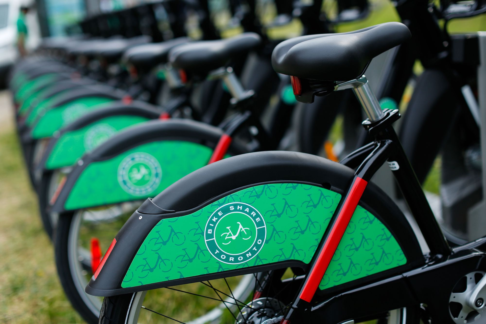

# Intro 

Rental bike companies spread across multiple cities all over North America operate with the purpose of being able to provide a bike for those in need throughout the city at any hour of the day. Lately (post covid), bike share ridership has grown massively seeing an average 30% growth in the annual members for the past two years consecutively for the city of Toronto. This is complimented by an increase in the network size of the docking stations, from just 80 stations (1000 bikes) in 2020 to about 625 stations (6,850 bikes) around the city of Toronto according to a [report](https://www.thestar.com/news/gta/2022/02/18/covid-19-helped-kick-torontos-bike-share-ridership-into-high-gear.html).




# Problem Motivation
I myself am a regular user of the city's Bikeshare service and rely on it for getting to different parts of the city. Even though the network of stations is quite vast, there is a huge variation is availability of these bikes. At times there is a possibility of me missing out these bikes due to their unavailability. On the contrary, there are also instances where I would see that the demand for these bikes are low while they are highly available in many locations without being used.

The current challenge is to know **the number of bikes that must be placed at different locations at different instances of time** to ensure that the comapnies get their maximum profit while providing people their rides. Hence it becomes important to tackle these instances and understand the demand for the bikes for different days and scenarios.

# Machine Learning
We use **ML and DL** to tackle this prediction problem, hence informing these companies about the demand beforehand so that they can deploy respective logistics to ensure adequate number of bikes are present in different locations.

We perform **EDA: Exploratory Data Analysis** (checkout EDA.ipynb) to visualize different features in our dataset and understand the underlying relations. Once I got a good understanding of these features, we build and use different machine learning and deep learning models to learn on these features and give us the respective predictions. We formulate the problem as a regression, hence sticking to Mean Squared Error and Mean Absolute Error as our metrics.

The following alogithms were trained and their results were compared:

* [__Deep Neural Networks__](https://scikit-learn.org/stable/modules/generated/sklearn.neural_network.MLPRegressor.html)
* [__K Nearest Neighbors__](https://scikit-learn.org/stable/modules/generated/sklearn.neighbors.KNeighborsRegressor.html)
* [__Partial Least Squares (PLS) Regression__](https://scikit-learn.org/stable/modules/generated/sklearn.cross_decomposition.PLSRegression.html)
* [__Decision Tree Regressor__](https://scikit-learn.org/stable/modules/generated/sklearn.tree.DecisionTreeRegressor.html)
* [__Gradient Boosting Regressor__](https://scikit-learn.org/stable/modules/generated/sklearn.ensemble.GradientBoostingRegressor.html)
* [__Logistic Regression__](https://scikit-learn.org/stable/modules/generated/sklearn.linear_model.LogisticRegression.html)
* [__Long Short Term Memory (LSTM)__](https://www.tensorflow.org/api_docs/python/tf/keras/layers/LSTM)


# Run 
```
python train.py --filepath --algorithm
```
# Conclusion
* We could see that gradient boosting algorithm performance in the cross-validation data was better than the other machine learning models used. 
* Deep Neural Networks also performed well but gradient boosting tree was the best machine learning model for predicting the bike demand. 
* We were able to generate a mean absolute error (MAE) of about 23 which is really good considering the scale of the problem at hand.
